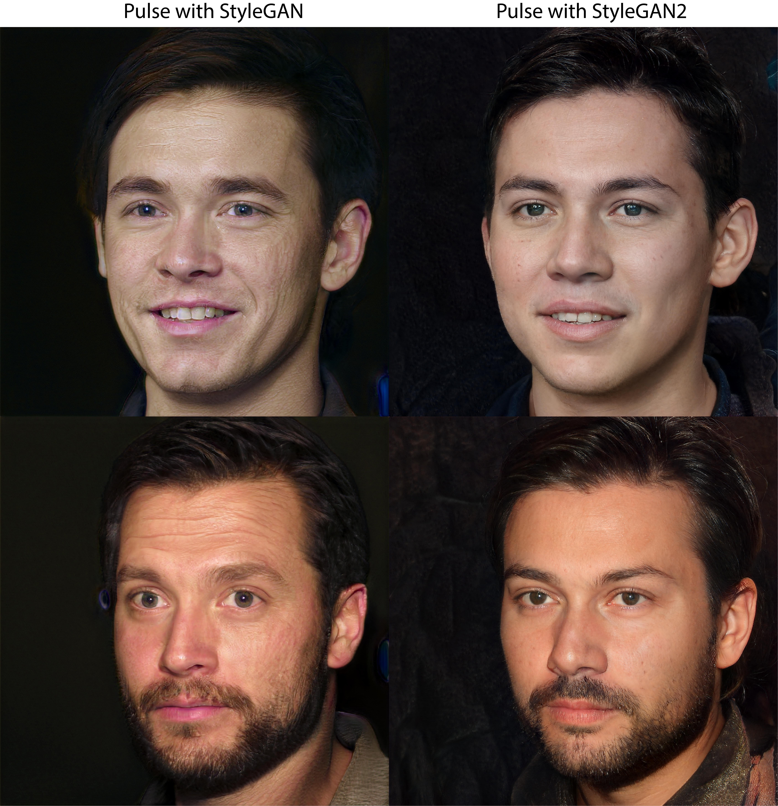

# pulse-stylegan2-implementation
 Unofficial StyleGAN2 implementation for PULSE: Self-Supervised Photo Upsampling via Latent Space Exploration of Generative Models. 
 
 The code is from the original repository: https://github.com/adamian98/pulse 
 
 Paper link: https://arxiv.org/pdf/2003.03808.pdf

 The link to the StyleGAN2 generator weights: https://drive.google.com/file/d/1wtNy8XyvRzwX-5eqnq82hhwyvtXUIoz4/view?usp=share_link 
 ( The generator weights have already been uploaded and added to StyleGAN and StyleGAN2 folders provided in links below.)
 
 The interactive colab for Multimodal Pulse-StyleGAN2 and Pulse-StyleGAN: https://colab.research.google.com/drive/1scOTnPCa_zWSZ4bI1jWQVdx9G31J8K_s?usp=sharing

You can directly download below folders  and upload them on your drive. After arranging the paths, you can run above colab. 

 StyleGAN: https://drive.google.com/drive/folders/1gmR0K1BmIw5SptByh_5Ouq0L4R7B1eXJ?usp=sharing
 
 StyleGAN2: https://drive.google.com/drive/folders/1TIdvEwRrcnirWOBwtm3M7c3qiatn2ehl?usp=sharing
 ## How to Run

The main file of interest for applying PULSE is `run.py`.
 
 
 ### Prereqs
 Setting up a local environment for StyleGAN2 can be problematic. Thus, I recommed cheking this [link](https://youtu.be/BCde68k6KXg).
 The code has been tested on Windows. However, original code wasn't originally implemented on Windows. Thus, for setting up, I also recommend checking this [link](https://youtu.be/sRu5j-mzOy0).

 For the full set of required Python packages, create a Conda environment from the provided YAML, e.g.

```
conda create -f environment.yml 
```
or (Anaconda on Windows):
```
conda env create -n pulse -f environment.yml
conda activate pulse
```

For a detailed configuration procedure, I recommend cheking the [original repository](https://github.com/adamian98/pulse) and the [Youtube link](https://youtu.be/sRu5j-mzOy0). 


## Example Results




